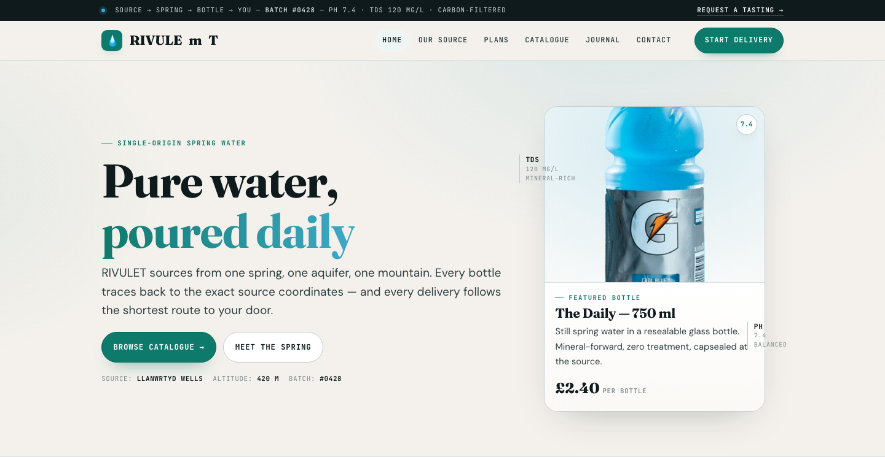

# SOURA — Spring Water Delivery Website Template

A premium, framework-free HTML/CSS/vanilla-JS template for bottled-water delivery, beverage brands, and subscription home-delivery services. Built bespoke from the subject — not a recolored scaffold.

**Live preview:** `index.html` (open in browser)
**Stack:** HTML5 · CSS3 (custom properties, Grid, Flex) · Vanilla JS (no build step)
**Fonts:** Fraunces (display) · DM Sans (body) · JetBrains Mono (labels/data) — all via Google Fonts
**License:** MIT — use commercially, modify freely.

---

## 📸 Screenshot



## Pages

| Page | Description | Link |
|------|-------------|------|
| **Home** | Micro-bar ticker, sticky header, vertical-ledger hero with centre vessel card, proof band (4 stats), source strip, tasting-sheet catalogue (3 bottles), subscription plans (3 tiers + cadence steps), testimonials, FAQ, CTA | [index.html](index.html) |
| **Our Source** | Page head, source story split layout, proof band, full mineral profile (pH/TDS/Calcium/Bicarbonate), values/principles | [about.html](about.html) |
| **Plans** | Three subscription tiers (weekly/fortnightly/monthly) with featured highlight, how-it-works cadence strip, delivery-area map + route cards | [service.html](service.html) |
| **Catalogue** | Tasting-sheet product grid with filter tabs (All/Still/Sparkling/Jug), 6 bottle cards with mineral notes + pricing | [product.html](product.html) |
| **Journal** | Batch purity reports, geology articles, sustainability stories — 3-column editorial grid | [blog.html](blog.html) |
| **Contact** | Contact form with inline validation, info cards (email/phone/wholesale/address/coverage check) | [contact.html](contact.html) |

---

## Design Distinction

**This template was authored fresh for a water-delivery subject and diverges from every sibling template on all 6 divergence axes:**

| Axis | SOURA (this template) | Sibling templates (MERIDIAN, AERION, KORVA, VOSSEN, OLIVO) |
|------|----------------------|------------------------------------------------------------|
| **Hero composition** | Vertical ledger: text left with mineral-data margins, glass vessel card right (product + label + pH bead). No split-headline pattern. | MERIDIAN has masthead + ticker. Others use split 1.05/.95 headline left / image right + 2 CTAs + chip row. |
| **Layout grammar** | Ledger + catalogue: vertical centre column with marginal annotations, proof band (4-cell dark), tasting-sheet grid, cadence steps. Content reads like a water sommelier's tasting sheet. | MERIDIAN uses broadsheet multi-column feed + sticky rail. Others use alternating section-stack bands (.section/.section.alt). |
| **Typography personality** | **Fraunces** (display, warm serif) + **DM Sans** (body, geometric clean) + **JetBrains Mono** (labels, batch data, mineral readings). Water ledger voice — editorial but data-rich. | MERIDIAN: Fraunces/Newsreader/Archivo (newspaper). Others: Space Grotesk/Sora/Cormorant + Manrope/Nunito/Jost/DM Sans. |
| **Color logic** | Spring-water palette: warm paper (`--paper`), deep mineral ink (`--ink`), spring teal (`--spring`), glacier blue (`--glacier`), cork accent (`--amber`). 3 ink steps + 2 water accents. Not a brand ramp — mineral/water/material reasoning. | MERIDIAN: newsprint paper + single kicker-red. Others: `--primary` brand ramp + `--n-50..900` neutral ramp. KORVA: dark lab with coral. |
| **Motion signature** | Pour/bead: `.pour-line` (scaleX wipe), `.bead-pop` (scale pop), `.reveal` (subtle 14px translateY — lighter than siblings' 22px). Pour-line draws like water flowing across a surface. | MERIDIAN: clip-path type-set wipe + breaking ticker. Others: generic `opacity:0 → 1` + `translateY(22px)` + marquee slide. |
| **Section inventory** | Micro-bar ticker → Proof band (dark) → Vertical-ledger hero → Source split → Tasting-sheet catalogue → Plans + cadence → Testimonials → FAQ → CTA band → Label-paper footer. | MERIDIAN: Topbar → Ticker → Masthead → Nav → Lead → Briefs → Feed → Rail → Topic Band → Newsletter. Others: Hero → 3 features → Approach → Stats → Projects → Quote → CTA. |

**Bottom line:** Strip the colors from SOURA and any sibling — they share **zero** layout grammar, component set, or motion vocabulary. This reads as a water sommelier's ledger, not a marketing site.

---

## Features

- **Micro-bar ticker** — mineral data stream (pH, TDS, batch) in monospace at top
- **Vertical-ledger hero** — text + glass vessel card with pH bead + marginal annotations
- **Proof band** — 4-cell dark stats (altitude, TDS, pH, delivery window) with count-up animation
- **Source split** — 1.05/.95 frame + numbered origin list
- **Tasting-sheet catalogue** — 3-column product grid with filter tabs (All/Still/Sparkling/Jug)
- **Subscription plans** — 3 tiers with featured highlight, cadence step-strip (4 steps with arrows)
- **Testimonials** — 3-column quote cards with star ratings
- **FAQ accordion** — expandable items with +/- toggle
- **CTA band** — dark gradient with dual actions
- **Label-paper footer** — 4-column grid with source coordinates
- **Pour-line + bead-pop animations** — water-themed reveal effects
- **Scroll reveals** — IntersectionObserver with staggered delays (`.d1`…`.d4`)
- **Contact form** — inline validation, no `alert()`, `.form-ok`/`.form-err` messages
- **Product filter** — client-side tab filtering on catalogue page
- **Active nav** — auto-highlight via `location.pathname`
- **Footer year** — `[data-year]` auto-fills current year
- **Reduced motion** — `@media (prefers-reduced-motion)` disables all animation
- **Original imagery** — 13 source images from Acuas (`assets/img/`): `water.png`, `about.jpg`, `blog-1/2/3.jpg`, `carousel-1/2.jpg`, `product-1/2/3.png`, `fact-bg.jpg`, `breadcrumb.jpg`, `Acuas.jpg`

---

## Quick Start

```bash
# No install, no build — just open
open index.html
# or serve locally
npx serve .
```

---

## File Structure

```
drinking-water-delivery-html-template/
├── index.html          # Home page
├── about.html          # Our Source
├── service.html        # Delivery Plans
├── product.html        # Catalogue
├── blog.html           # Journal
├── contact.html        # Contact
├── assets/
│   ├── css/
│   │   └── base.css    # Bespoke design system (~762 lines)
│   ├── js/
│   │   └── main.js     # Bespoke interactions (~140 lines)
│   └── img/            # 13 original Acuas images
└── README.md           # This file
```

---

## Customization

- **Colors:** Edit `:root` tokens in `assets/css/base.css` — `--spring` (teal), `--glacier` (blue), `--amber` (cork), `--paper`, `--ink`
- **Fonts:** Swap Google Fonts `<link>` in each HTML `<head>` and update `--font-display/--font-body/--font-mono`
- **Sections:** Add/remove `.catalog`, `.plans`, `.quotes`, `.faq` blocks in each HTML page
- **Products:** Duplicate `.bottle` cards in `product.html`, change image/name/price/mineral notes
- **Plans:** Edit `.plan` tiers in `service.html` — pricing, features, tier count

---

## Browser Support

Modern evergreen browsers (Chrome 90+, Firefox 88+, Safari 14+, Edge 90+).
Graceful degradation: CSS custom properties, Grid, Flex, `clamp()`, `IntersectionObserver` — all polyfillable if needed.

---

## Credits

- **Images:** Original Acuas source assets (included in `assets/img/`)
- **Fonts:** Fraunces (Undercase Type), DM Sans (Colophon Foundry), JetBrains Mono (JetBrains) — all SIL OFL via Google Fonts
- **Icons:** Inline Unicode (💧 ● ☰ 📍 ♻️ 🌿) — no icon font dependency

---

Let's Build Something Together 🚀
https://tally.so/r/q4q1L9
